 # Reto_3

Pseudocodigos y diagramas de flujo de los retos 3.1 y 3.2
# Diagrama de flujo de todos los numeros primos hasta n

```mermaid
graph TB;
    id1(inicio)-->id2[numero n]-->id3[x = 2]-->id4[listado de numeros i desde x hasta n]-->id5[listado de numeros desde x hasta i^0.5]-->id6{¿el residuo de i / z es 0?}-- si-->id7[no es primo]
    id6{¿el residuo de i / z es 0?}-- no -->id8{¿existe otro z por el que se pueda dividir i?}-- si -->id6{¿el residuo de i / z es 0?}
    id8{¿existe otro z por el que se pueda dividir i?}-- no -->id9["es primo 😊"]-->id10(fin) 
```

# Pseudocodigo de todos los numeros primos hasta n
```pseudocode
n : int
i : int
z : int
x : int

INICIO
  x := 2
  para cada numero i desde x hasta n hacer
    para cada numero z desde x hasta (i**0.5) hacer
      si ( i % z = 0 ) entonces
        es_primo = falso
      sino
        si ( i % z != 0) entonces
        es_primo = verdadero
        fin si
      fin si
    fin para
    si  es_primo = verdadero entonces
      print ( i 'es numero primo' )
    si  es_primo = falso entonces
      print ( i 'no es numero primo )
    fin si
  fin para
FIN
```
# Diagrama de flujo del "procedimiento matematico" para  encontrar una raiz cuadrada


# pseudocodigo del "procedimiento matematico" para  encontrar una raiz cuadrada
```pseudocode

n : int
raiz_cuadrada : float
z : float

INICIO
  n / 2 = raiz_cuadrada
    si (raiz_cuadrada ** 2 - n) <= 0.1 entonces
      raiz_cuadrada = verdadero : z
    sino
      mientras (raiz_cuadrada ** 2 - n) > 0.1 hacer
         raiz_cuadrada = (raiz_cuadrada ** 2 + n) / raiz_cuadrada * 2
           si (raiz_cuadrada ** 2 - n) > 0.1 entonces
               raiz_cuadrada = falso
             sino
               raiz_cuadrada = verdadero : z
                 si raizcuadrada = verdadero entonces
                   print "la_raiz_cuadrada_de_'n'_es_aproximadamente_'z'"
                 fin si
           fin si
      fin mientras
    fin si
FIN
```
